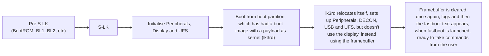

# lk3rd - A (3rd stage?!) bootloader for Exynos 990 devices.
And it gets even better...

## What?!
It's a lot of things.
* a bootloader (duh?)
* a hardware testing playground
* a fastboot interface
* a learning experience :)

## Let me install it!
Sure, check the release tab and follow the instructions. Be careful when using the bootloader though, we are not responsible for your actions when you use the bootloader, if you brick cause of it, it is not our fault.

## What devices does it run on?
* the canvas family
* the hubble family
* r8s, has no family

## What is this commit history?!
We based lk3rd off of Linaro's source code for their Exynos 850 board, which contained code for Exynos 990 as well. Thus, the commit history is a mix of Linaro/Samsung/upstream.

## What works?
Booting, display (with DECON), UFS and USB. Regulators seem to initialize, and the device is charging.

## Boot Sequence
You may be wondering, how the hell are you booting this? We can't replace our bootloaders!
Well, you're right, but we dont replace our bootloaders ;).
This flowchart of what happens will show you how we actually boot lk3rd.



## Credits

- [Samsung](https://samsung.com) ```Making the bootloader```
- [Linaro](https://www.linaro.org/) ```Specifically the 96Boards group, thanks to them we had a base bootloader from Samsung to modify```
- [BotchedRPR](https://github.com/BotchedRPR) ```Did loads of work, rewrote the entire PIT library so we had UFS up and got the bootloader to initially boot```
- [ExtremeXT](https://github.com/ExtremeXT) ```Gave us info on ECT (Exynos Characteristics Table), which helped us boot android```

## TODO

- [x] Get UFS Fully up
- [x] Position independent code
- [x] Booting Android
- [ ] Implement fastboot boot (80% done, just need to figure out why fastboot boot on android doesn't work)

Cheers from the Exynos990-Mainline team!
